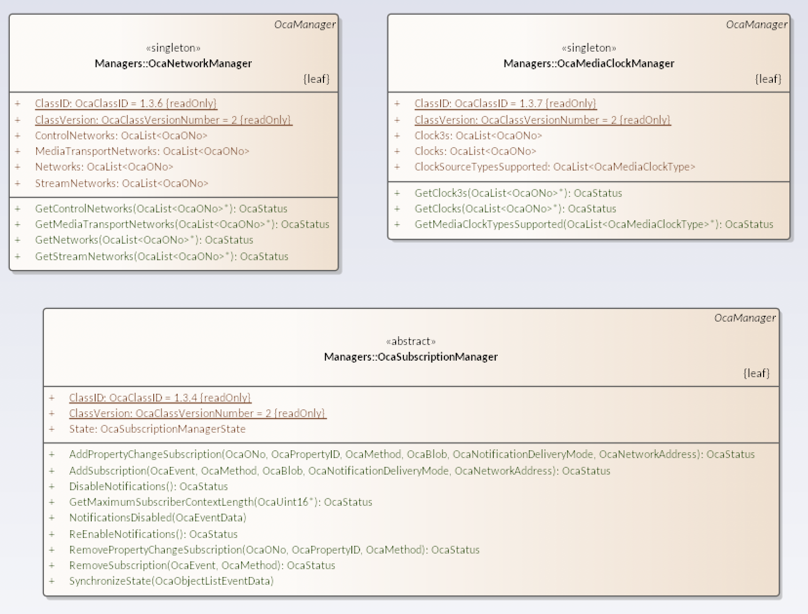
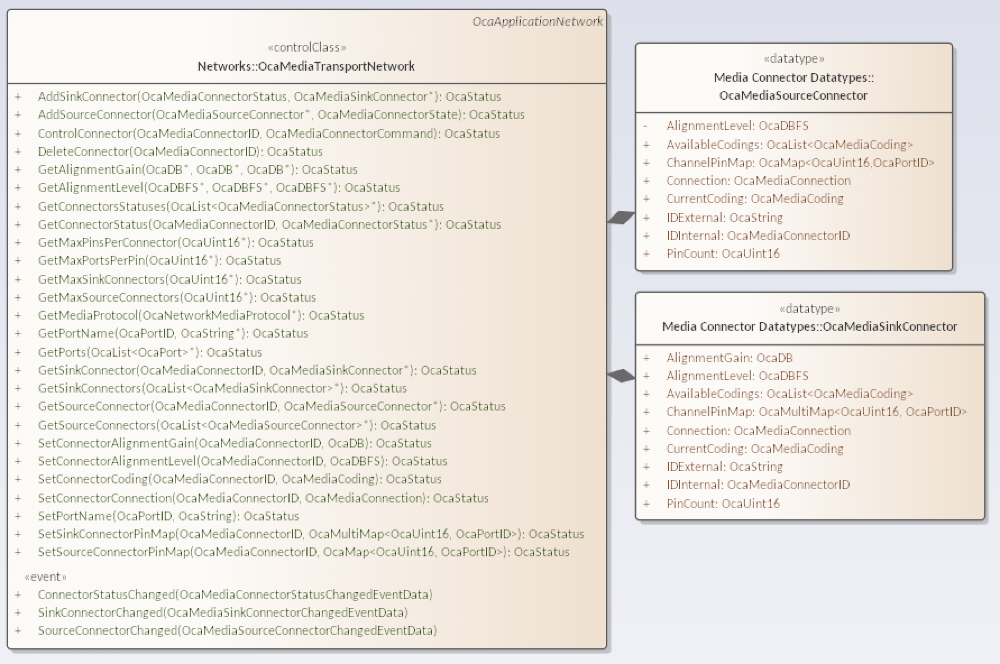
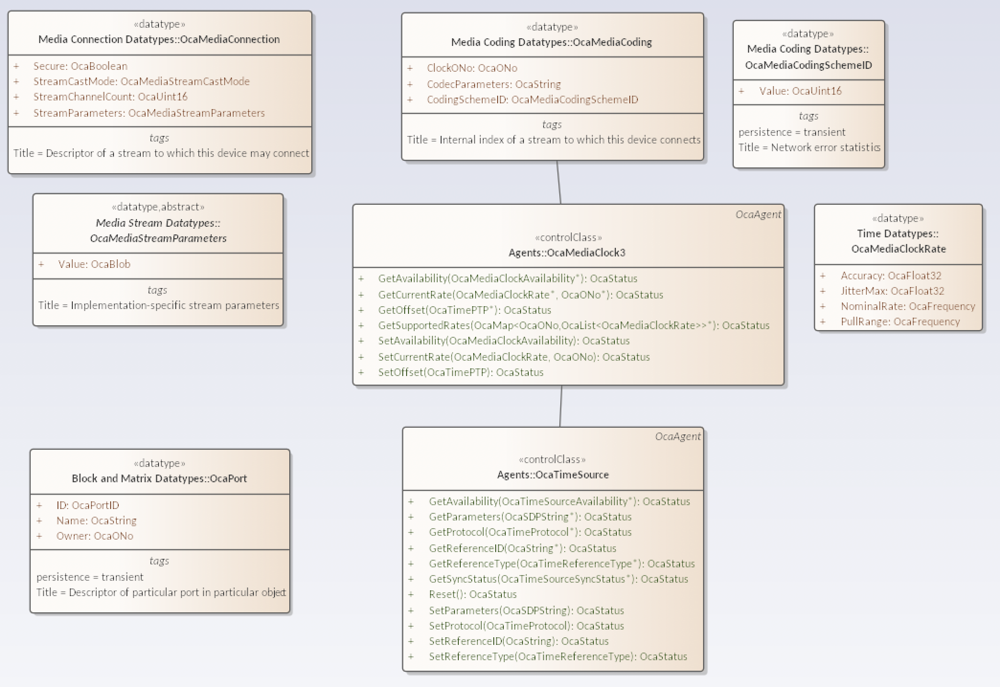
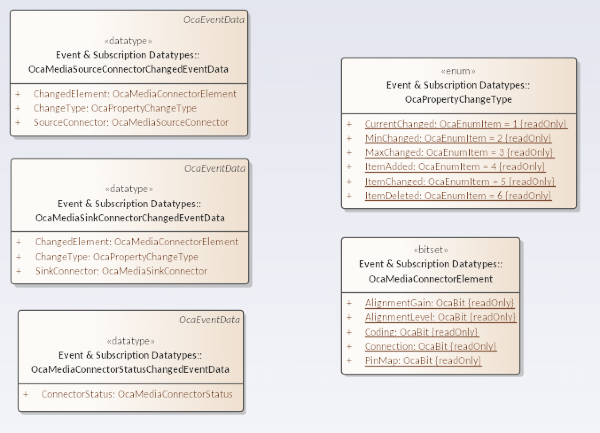

# Media/Streams: Connection Management v3 (CM3)

A device supporting media streaming (ie implementing an `OcaMediaTransportNetwork`) must implement the following managers (a.s. figure 1):

1. OcaNetworkManager (required anyways)
2. OcaMediaClockManager
3. OcaSubscriptionManager

In particular there must be at least lightweight subscriptions (see `subscriptions.md`) supported by the device for the respective required events of `OcaMediaTransportNetwork` (see `occ_classes.md`).

|  |
|:--:|
| Fig 1. Required managers |

See figures 2 - 4 for the core datatypes and classes used to describe and change stream parameters.

|  |
|:--:|
| Fig 2. `OcaMediaTransportNetwork` |

|  |
|:--:|
| Fig 3. Support datatypes (non-exhaustive) |

|  |
|:--:|
| Fig 4. Notifications |
