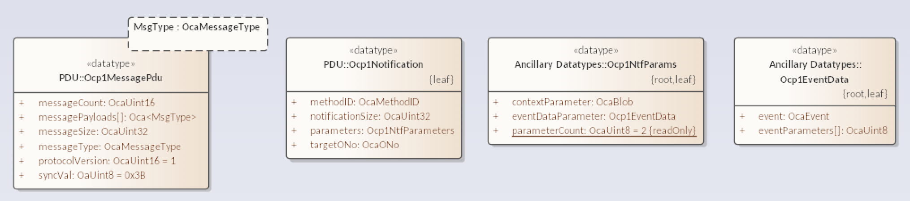
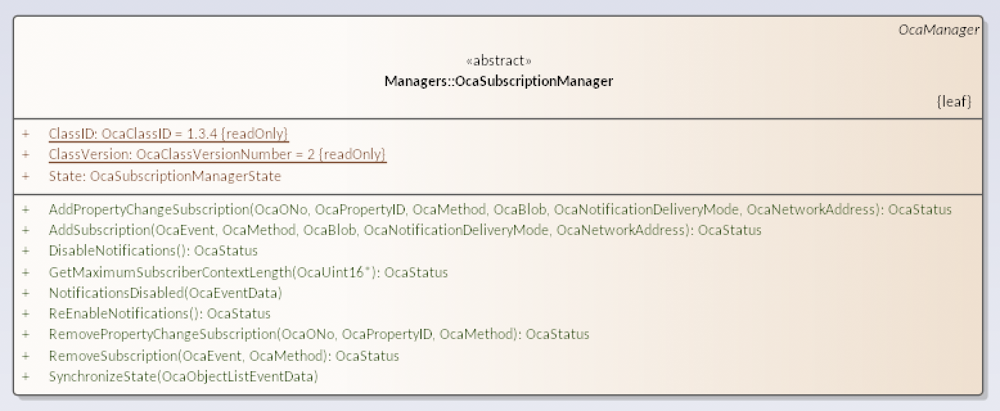

# Subscriptions

Subscriptions provide a push-based notification system where controllers can subscribe to `events` as defined by OCC classes and will thus be notified by devices of said events.

Notifications are sent either by a `reliable` or `fast` method where the reliable method typically means the control port used by the controller, an UDP port respectively for the fast method. Additionally different target hosts can be specified, in particular multicast addresses.

Subscriptions also provide a means for subscribers to specify context consisting of arbitrary data and particular subscriber object and method (likely for use with custom classes).

|  |
|:--:|
| Fig 1. Notifications |

Three forms of subscription support are formally defined:

1. No subscriptions

   The device does not support subscriptions (ie events). The subscription manager MUST NOT exist.

2. Lightweight subscriptions

   The device supports (some) subscriptions (ie events) but does not support storing of subscriber provided callback info. Any notifications sent by the device will have a registered subscriber method and subscriber context of all zeros, an blob with length value of zero respectively.
   Lightweight subscriptions are particularly interesting to constrained devices.

3. Full subscriptions

   The device supports (some) subscriptions (ie events), in particular subscriber method and context can be specified and will be sent within notifictations.

Subscribing and unsubscribing happens through the subscription manager singleton (a.s. figure 2).

|  |
|:--:|
| Fig 2. Subscription manager |
